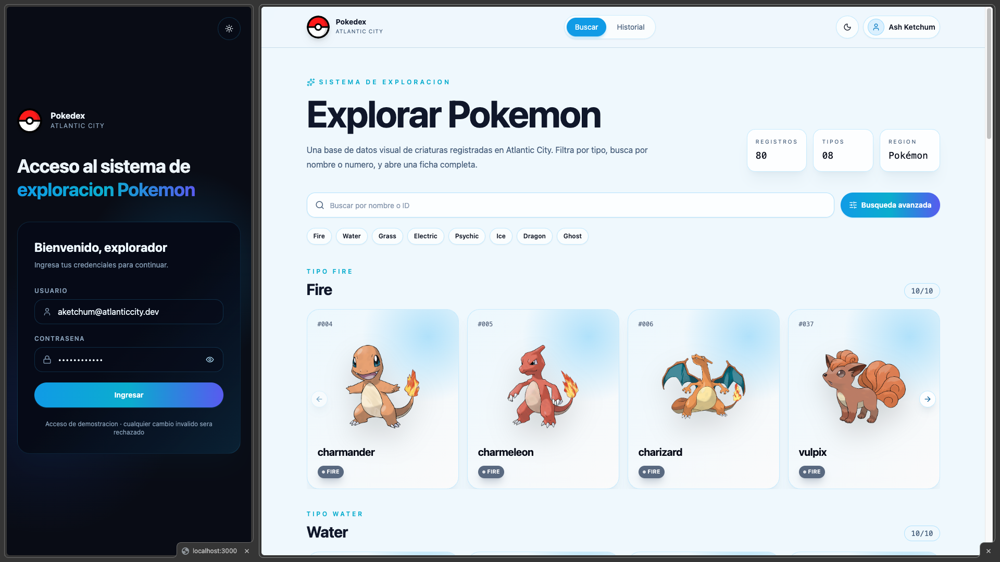

# Atlantic City Technical Test

Pokedex premium construida como prueba tecnica Frontend Senior. El proyecto usa
un monorepo con React, Vite, TypeScript y microfrontends con Module Federation:
un Shell host y dos MFEs independientes para detalle e historial.



## Descripcion Del Reto

La aplicacion permite explorar Pokemon desde PokeAPI, abrir una ficha de detalle
en un microfrontend federado, guardar visitas en historial persistente y mostrar
el ultimo Pokemon visitado al volver al Home o al Historial.

El foco tecnico esta en:

- arquitectura modular y defendible;
- microfrontends reales desde etapas tempranas;
- dominio, aplicacion e infraestructura separados;
- UI compartida con shadcn/ui;
- experiencia responsive, light/dark y mobile-first;
- consumo real de PokeAPI con estados de carga, error y vacio.

## Stack Usado

- React 19
- Vite
- TypeScript estricto
- pnpm workspaces
- Module Federation con `@module-federation/vite`
- TanStack Query
- Axios
- Zustand persist
- React Hook Form
- Zod
- TailwindCSS
- shadcn/ui
- Sonner
- Lucide React
- ESLint flat config
- React Compiler

## Inicio Rapido

Requisitos:

- Node.js 20+
- pnpm 10+

Instalacion:

```bash
pnpm install
```

Levantar todo:

```bash
pnpm dev
```

Abrir:

```txt
Shell:           http://localhost:3000
Pokemon Detail:  http://localhost:3001
Pokemon History: http://localhost:3002
```

Credenciales demo:

```txt
Usuario:  aketchum@atlanticcity.dev
Password: Atlantic2026
```

## Scripts

```bash
pnpm dev
pnpm dev:shell
pnpm dev:detail
pnpm dev:history
pnpm build
pnpm lint
```

Detalle:

- `pnpm dev`: levanta Shell, Detail e History en paralelo.
- `pnpm dev:shell`: levanta Shell en `http://localhost:3000`.
- `pnpm dev:detail`: levanta Pokemon Detail en `http://localhost:3001`.
- `pnpm dev:history`: levanta Pokemon History en `http://localhost:3002`.
- `pnpm build`: compila todos los packages y apps.
- `pnpm lint`: ejecuta ESLint en el workspace.

## Puertos

| App                    | Puerto | Rol              |
| ---------------------- | ------ | ---------------- |
| `apps/shell`           | `3000` | Host principal   |
| `apps/pokemon-detail`  | `3001` | MFE de detalle   |
| `apps/pokemon-history` | `3002` | MFE de historial |

## Como Levantar Cada App Standalone

Shell:

```bash
pnpm dev:shell
```

Detail MFE:

```bash
pnpm dev:detail
```

History MFE:

```bash
pnpm dev:history
```

Los MFEs funcionan standalone para desarrollo y QA, pero el flujo completo se
valida desde el Shell.

## Arquitectura Monorepo

```txt
apps/
  shell/
  pokemon-detail/
  pokemon-history/

packages/
  application/
  config/
  domain/
  infrastructure/
  ui/
  utils/
```

Responsabilidades:

- `domain`: tipos puros del negocio, sin React, browser APIs ni Axios.
- `application`: casos de uso y event bus tipado.
- `infrastructure`: Axios, repositorios PokeAPI y LocalStorage.
- `ui`: componentes compartidos, shadcn/ui, estados visuales y layout atoms.
- `config`: puertos, URLs remotas, PokeAPI base URL y config compartida Vite.
- `utils`: helpers puros como normalizacion, imagenes e IDs.

## Module Federation

Remotos:

```txt
pokemonDetail/App  -> http://localhost:3001/remoteEntry.js
pokemonHistory/App -> http://localhost:3002/remoteEntry.js
```

El Shell consume:

- `pokemonDetail/App`
- `pokemonHistory/App`

Dependencias compartidas singleton:

- `react`
- `react-dom`
- `react-router-dom`
- `@tanstack/react-query`

En deploy, el Shell usa variables de entorno para apuntar a las URLs publicas:

```txt
VITE_POKEMON_DETAIL_REMOTE_URL
VITE_POKEMON_HISTORY_REMOTE_URL
```

## Funcionalidades

Shell:

- login con React Hook Form + Zod;
- sesion persistida con Zustand;
- theme light/dark persistido;
- rutas protegidas;
- layout autenticado;
- Home con categorias reales;
- buscador fullscreen con infinite scroll;
- dropdown de usuario;
- logout;
- toast global.

Home:

- categorias reales desde PokeAPI;
- filtros visuales por tipo;
- cards responsive;
- carousel por categoria;
- apertura de Detail remoto en modal.

Pokemon Detail MFE:

- funciona standalone en `3001`;
- recibe `pokemonName` cuando corre federado;
- consulta detalle real en PokeAPI;
- muestra imagen, tipos, altura, peso, experiencia, habilidades y stats;
- guarda visita en historial;
- incrementa contador si el Pokemon ya existe;
- emite evento `pokemon:visited`.

Pokemon History MFE:

- funciona standalone en `3002`;
- lee historial desde LocalStorage;
- escucha `pokemon:visited`, `pokemon-history:cleared` y `storage`;
- muestra visitas, conteos y resumen;
- permite limpiar historial;
- renderiza empty state si no hay visitas.

## Uso De PokeAPI

Base URL:

```txt
https://pokeapi.co/api/v2
```

Configurable con:

```txt
VITE_POKE_API_BASE_URL
```

Endpoints usados:

```txt
GET /type/{type}
GET /pokemon?limit=30&offset=0
GET /pokemon/{name}
```

La capa `infrastructure` mantiene responses/adapters separados para evitar que
un cambio del contrato externo contamine el dominio.

## Buscador Fullscreen

El buscador usa `Dialog` fullscreen con TanStack Query:

- carga inicial de 30 Pokemon;
- infinite scroll con `offset += 30`;
- busqueda exacta por nombre;
- normalizacion con `trim`, lowercase y sin espacios internos;
- debounce antes de consultar;
- estados de loading, error, empty y no encontrado;
- cada resultado abre el Detail remoto.

## Toast Ultimo Visitado

Regla implementada:

- al entrar al Home o History, si existe historial, se muestra el ultimo Pokemon
  visitado;
- el toast se oculta automaticamente;
- incluye imagen pequena del Pokemon;
- no aparece en `/login`;
- el historial sigue siendo la fuente de verdad.

Cada visita genera un `visitId`, incrementa `visitCount` si ya existia y mueve el
Pokemon al inicio del historial.

## Variables De Entorno

Ejemplo local:

```txt
VITE_POKE_API_BASE_URL=https://pokeapi.co/api/v2
VITE_POKEMON_DETAIL_REMOTE_URL=http://localhost:3001/remoteEntry.js
VITE_POKEMON_HISTORY_REMOTE_URL=http://localhost:3002/remoteEntry.js
```

En deploy, reemplazar las URLs de remotos por las URLs publicas.

## Build

Compilar todo:

```bash
pnpm build
```

El build genera:

```txt
apps/shell/dist
apps/pokemon-detail/dist
apps/pokemon-history/dist
```

Cada app es estatica y puede publicarse de forma independiente.

## Deploy Demo

La estrategia recomendada esta documentada en [DEPLOYMENT.md](./DEPLOYMENT.md).

Resumen Netlify:

1. Deployar `atlanticcity-pokemon-detail`.
2. Deployar `atlanticcity-pokemon-history`.
3. Configurar el Shell con las URLs publicas de ambos `remoteEntry.js`.
4. Deployar `atlanticcity-pokedex`.

Cada build copia `public/_redirects` al `dist` para soportar refresh en rutas SPA.

## Decisiones Tecnicas

- `pnpm` como package manager unico para workspaces.
- Module Federation real, pero manteniendo remotos standalone.
- TanStack Query para data fetching y cache en memoria.
- Axios aislado en `infrastructure`.
- LocalStorage como persistencia simple para sesion, theme e historial.
- Zustand persist para estado de Shell.
- shadcn/ui como base para consistencia visual.
- Sonner para toasts globales.
- Event bus con `CustomEvent` para comunicar Shell y MFEs.
- Config centralizada en `packages/config`.

## Tradeoffs

- LocalStorage esta separado por dominio/origen; en local, `localhost:3000` y
  `localhost:3002` no comparten historial porque son origenes distintos.
  Federado dentro del Shell si comparte el storage del Shell.
- El login es demo, sin backend real ni JWT.
- La cache de TanStack Query no es persistente.
- Los MFEs se despliegan como tres sitios estaticos separados.
- Las URLs de remotos se resuelven por variables de entorno en build-time.

## Mejoras Futuras

- Autenticacion real con backend.
- Persistencia remota para historial.
- Tests automatizados E2E con Playwright.
- CI/CD con previews por cada app.
- Versionado de contratos entre Shell y MFEs.
- Observabilidad de errores de remotos.
- Mejoras de HMR para desarrollo de MFEs.
- Virtualizacion para listas muy grandes.
- Ruta dedicada para detalle: `/pokemon/:name`.
